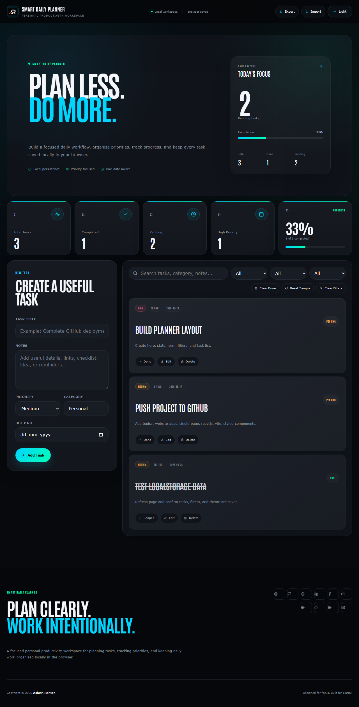

# Smart Daily Planner UI

A local-first React and Vite productivity workspace for creating tasks, tracking progress, filtering priorities, and keeping daily work organized in the browser.



## Features

- Create, edit, complete, and delete tasks
- Search and filter by priority, status, and category
- Progress statistics and completion tracking
- LocalStorage persistence with JSON import and export
- Dark and light themes with responsive layout
- Fixed branded header, icon-only footer links, and go-to-top control

## Tech stack

- React and Vite
- styled-components
- React Icons and SweetAlert2
- LocalStorage for task persistence

## Run locally

```bash
npm install
npm run dev
```

## Deployment

Live app: [https://a2rp.github.io/smart-daily-planner-ui/](https://a2rp.github.io/smart-daily-planner-ui/)

## Links

- Portfolio: [https://www.ashishranjan.net/](https://www.ashishranjan.net/)
- GitHub: [https://github.com/a2rp](https://github.com/a2rp)
- CodePen: [https://codepen.io/ash1198](https://codepen.io/ash1198)
- LinkedIn: [https://www.linkedin.com/in/aashishranjan](https://www.linkedin.com/in/aashishranjan)
- Facebook: [https://www.facebook.com/theash.ashish/](https://www.facebook.com/theash.ashish/)
- YouTube: [https://www.youtube.com/@ashishranjan-ashz?sub_confirmation=1](https://www.youtube.com/@ashishranjan-ashz?sub_confirmation=1)
- Email: [ash.ranjan09@gmail.com](mailto:ash.ranjan09@gmail.com)

## Support

- Support: [https://a2rp-donation-page.netlify.app/](https://a2rp-donation-page.netlify.app/)
- Buy Me a Coffee: [https://buymeacoffee.com/a2rp](https://buymeacoffee.com/a2rp)
- Patreon: [https://patreon.com/a2rp](https://patreon.com/a2rp)