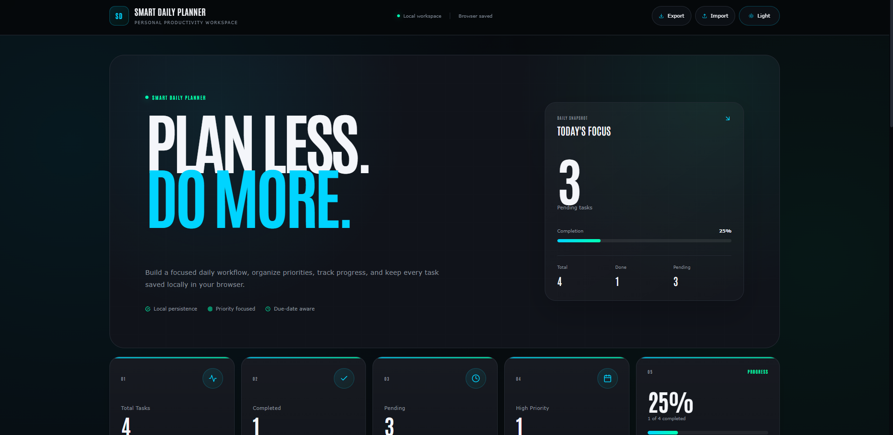

# Smart Daily Planner UI

A clean and modern React-based daily planner for organizing tasks, tracking progress, and managing daily productivity with a responsive interface and local storage support.



## ✨ Features

- Create, edit and delete tasks
- Mark tasks as completed
- Search and filter tasks
- Progress statistics dashboard
- Import and export tasks (JSON)
- Dark and light theme
- Local Storage persistence
- Fully responsive design

## 🛠️ Tech Stack

- React
- Vite
- styled-components
- SweetAlert2
- React Icons

## 📦 Installation

```bash
git clone https://github.com/a2rp/smart-daily-planner-ui.git

cd smart-daily-planner-ui

npm install

npm run dev
```

## 📄 License

This project is licensed under the MIT License.

---

## 👨‍💻 Developed By

**Ashish Ranjan**

Full-Stack Web Developer

🌐 Portfolio  
https://www.ashishranjan.net

💻 GitHub  
https://github.com/a2rp

💼 LinkedIn  
https://www.linkedin.com/in/aashishranjan

🖊️ CodePen  
https://codepen.io/ash1198

📺 YouTube  
https://www.youtube.com/@ashishranjan-ashz

📘 Facebook  
https://www.facebook.com/theash.ashish/

❤️ Support  
https://a2rp-donation-page.netlify.app/

☕ Buy Me a Coffee  
https://buymeacoffee.com/a2rp

🎁 Patreon  
https://patreon.com/a2rp

📧 Email  
ash.ranjan09@gmail.com
